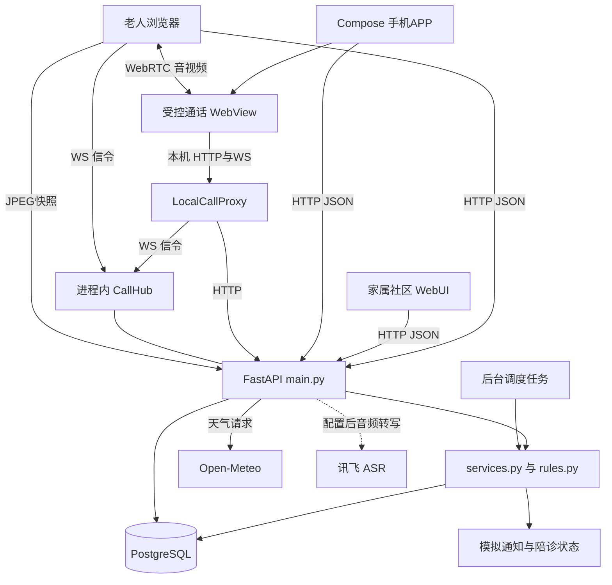
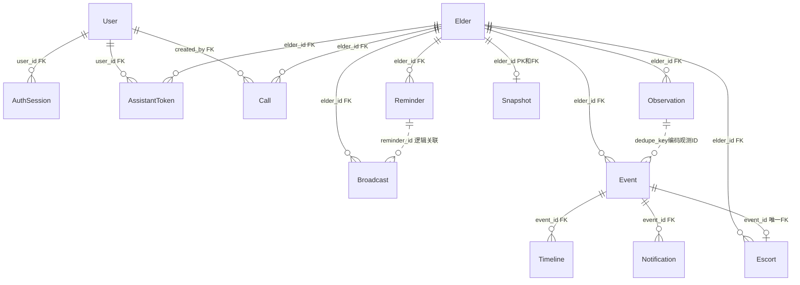
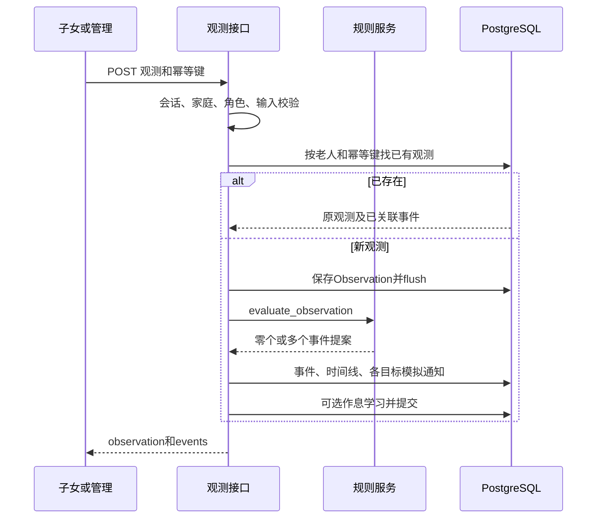
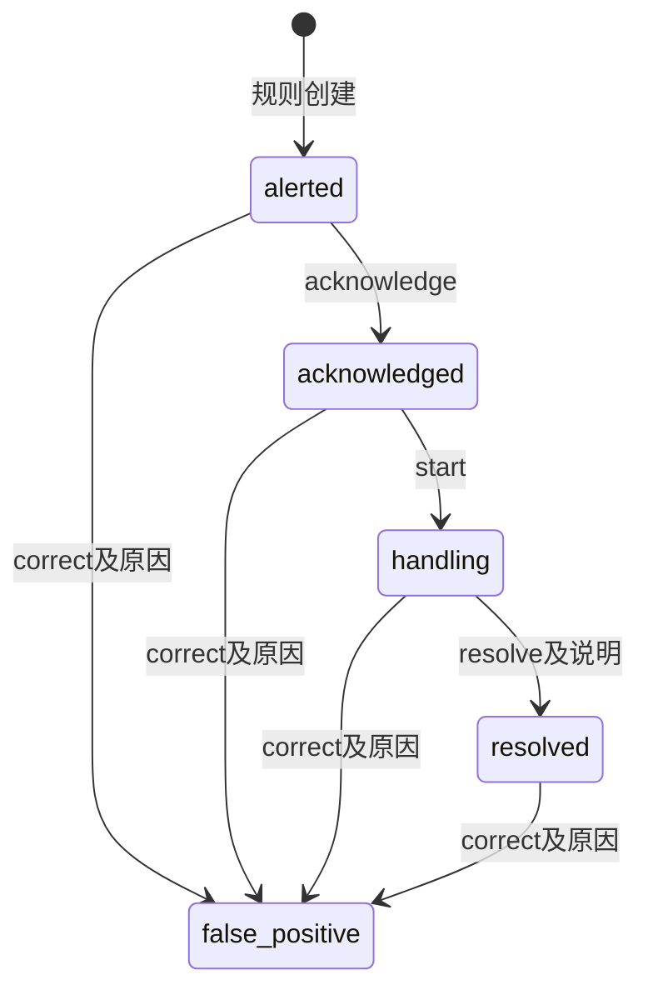
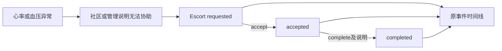
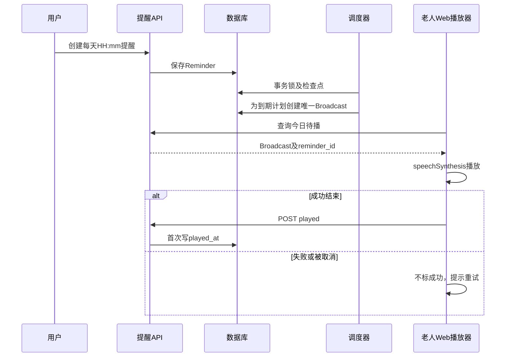
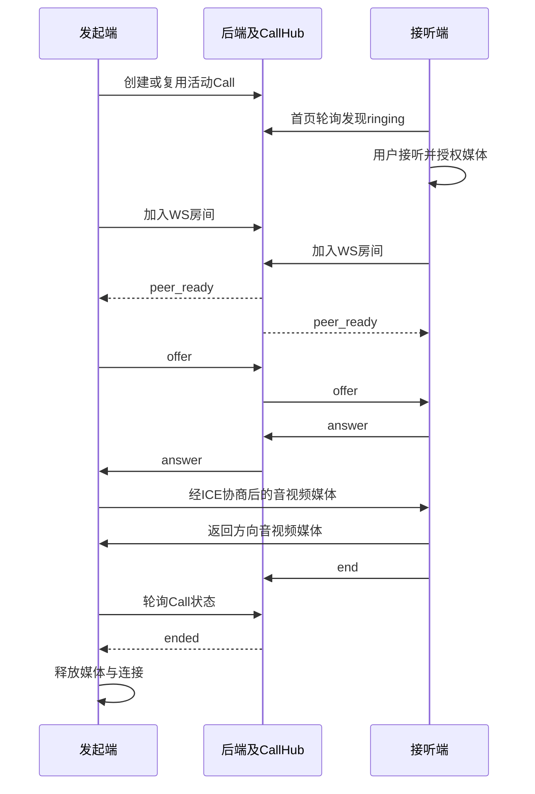

# 老友 — 开发者文档

> **文档梗概**：帮助新开发者理解全部功能如何运行、数据如何变化，以及从哪里修改和验证。
>
> **具体规划法则**：本文描述首版基线及工作区当前实现；字段原件在11与代码，安装封包查12，历史验证查03，不把待接服务当已实现。
>
> **最后一次更新时间**：2026-09-09
>
> **更新者**：REL组

## 目录

- [1. 接手路线与产品角色](#1-接手路线与产品角色)
- [2. 当前系统架构](#2-当前系统架构)
- [3. 目录职责与代码入口](#3-目录职责与代码入口)
- [4. 数据模型与持久化语义](#4-数据模型与持久化语义)
- [5. 登录与授权链路](#5-登录与授权链路)
- [6. 观测规则与作息学习](#6-观测规则与作息学习)
- [7. 异常处置与误报修正](#7-异常处置与误报修正)
- [8. 通知分流与陪诊流程](#8-通知分流与陪诊流程)
- [9. 用药计划与定时播报](#9-用药计划与定时播报)
  - [9.1 天气与健康内容](#91-天气与健康内容生成)
- [10. 指令助手与方言语音](#10-指令助手与方言语音)
- [11. 摄像头与快照](#11-摄像头与快照)
- [12. 视频通话与资源释放](#12-视频通话与资源释放)
- [13. Web页面和刷新策略](#13-web页面和刷新策略)
- [14. Android原生端](#14-android原生端)
- [15. 运行构建与环境配置](#15-运行构建与环境配置)
  - [15.1 本机启动](#151-本机启动)
  - [15.2 环境准备](#152-新开发者环境准备)
  - [15.3 配置位置](#153-配置位置与生效方式)
  - [15.4 两端构建](#154-前端与安卓构建)
  - [15.5 手机联通](#155-手机联通)
  - [15.6 便携封包](#156-windows便携包与发布构建)
- [16. 接口查询与常见修改路径](#16-接口查询与常见修改路径)
- [17. 验证分层与历史证据](#17-验证分层与历史证据)
- [18. 排查索引与当前限制](#18-排查索引与当前限制)

## 1. 接手路线与产品角色

先启动本机版本并分别进入老人、子女、社区界面，再按“架构→数据→一条异常的完整流程→自己要改的模块”阅读。第一轮建议用一条模拟跌倒观测完成确认、处理和查看时间线；随后再看提醒和视频，避免把界面状态当成后端事实。

| 角色 | 主要操作 | 数据范围 |
|---|---|---|
| `elder` | 总控屏、提醒、助手、摄像头、通话，读取自己的记录 | `User.elder_id` 指向的老人 |
| `child` | 读取家庭信息，编辑提醒/设置，处置和修正误报，通话 | `family_id` 相同的老人 |
| `community` | 查看分配社区数据，确认通知、处置事件、陪诊 | `community_id` 相同的老人 |
| `admin` | 演示管理、模拟观测、通知故障/重试及全局查看 | 所有老人 |

当前智能体是确定性的本地指令助手，未连接开放域大模型。业务规则、状态写入与权限在后端，前端不能通过角色按钮绕开权限。视觉模型、真实穿戴设备、真实机构调度未接入；这些边界贯穿手册，不作为已实现的隐藏能力。

**快速查询**：改异常判断看第6—8节；改提醒看第9节；改助手/方言看第10节；改媒体看第11—12节；改页面/APP看第13—14节；新电脑接手看第15节；查测试和问题看第17—18节。

## 2. 当前系统架构

下面是当前实现图，不是待建架构。后端是一个进程内按职责分文件的单体，没有消息队列、微服务或独立推理服务。



`main.py`负责启动、鉴权依赖、路由及WebSocket；`services.py`负责业务编排、序列化、调度和外部边界；`rules.py`只根据观测计算事件提案。PostgreSQL是真正的数据来源，浏览器和APP只缓存展示/交互状态。

**必须保持单Uvicorn worker运行**：CallHub房间和连接存在进程内，多个worker之间没有共享信令。调度使用数据库锁并不代表整个应用已经支持多进程部署。当前启动脚本也没有配置多worker。

生产构建的Web由同一个后端进程托管；Vite开发服务只是开发入口。WebRTC媒体不经FastAPI转发，JPEG快照也不是WebRTC流或视频存档。

## 3. 目录职责与代码入口

| 位置与关键符号 | 职责 | 修改时应同时关注 |
|---|---|---|
| [backend/app/main.py](../backend/app/main.py)：`lifespan`、各路由、`CallHub` | 应用入口、权限、提交事务、HTTP/WS、静态托管 | 下游请求类型、服务函数和客户端调用 |
| [services.py](../backend/app/services.py)：`add_observation`、`schedule_due_broadcasts`、`*_dict` | 跨表业务、序列化、调度、天气和指令解析 | 模型、规则、数据库测试 |
| [rules.py](../backend/app/rules.py)：`evaluate_observation`、`is_night` | 纯规则计算，不发通知、不写DB | 输入校验、通知分流、规则回归 |
| [models.py](../backend/app/models.py) | SQLAlchemy表、索引、默认设置 | 既有数据迁移；`create_all`不会升级旧列 |
| [schemas.py](../backend/app/schemas.py) | Pydantic请求约束 | UI表单和API契约，不只改数据库类型 |
| [security.py](../backend/app/security.py)、[db.py](../backend/app/db.py)、[config.py](../backend/app/config.py) | 会话、连接与初始化、环境配置 | 启动脚本和权限测试 |
| [integrations/xfyun.py](../backend/app/integrations/xfyun.py) | PCM上传、签名、转写结果和服务错误 | AssistantPanel录音编码与capabilities |
| [web/src/App.vue](../web/src/App.vue) | 登录恢复、History路由、跨页面播放器/来电、通话前后摄像头交接 | 独立通话链接与服务端SPA入口 |
| [web/src/lib/api.ts](../web/src/lib/api.ts)、[types.ts](../web/src/types.ts) | 浏览器请求、会话存储、类型 | 后端字段、二进制请求与错误格式 |
| [web/src/pages](../web/src/pages)、[components](../web/src/components) | 页面及独立生命周期组件 | 第13节页面索引 |
| [MainActivity.kt](../android/app/src/main/java/cn/laoyou/app/MainActivity.kt)：`LaoyouApp` | Compose状态、页面、通知、来电、WebView | Activity生命周期和IO协程 |
| [ApiClient.kt](../android/app/src/main/java/cn/laoyou/app/ApiClient.kt) | 原生DTO、JSON映射、HTTP、时间/状态显示 | 字段缺失语义、服务地址与token |
| [scripts](../scripts) | 本机启动、数据库、模拟器、构建和烟测 | 第15、17节操作说明 |
| `runtime/`、`tmp/`、`artifacts/` | 运行数据/依赖、临时输出、交付件/证据 | Git忽略规则和敏感文件保护 |

没有独立的后端router目录、Android ViewModel/Room层或后台推送服务；不要按框架惯例假定它们存在。当前后端是同步SQLAlchemy Session；网络/调度并非全部异步。

## 4. 数据模型与持久化语义

字段类型和默认值以[models.py](../backend/app/models.py)为唯一权威，完整接口字段只在[接口契约](01-子文档/11-接口契约.md)维护。下面的图回答“谁引用谁”；标为逻辑关联的关系没有数据库外键。



| 对象 | 必须理解的语义 |
|---|---|
| User / Elder | 家庭和社区由字符串ID关联，没有Family或Community实体表。`User.elder_id`也没有FK。 |
| AuthSession | 不是JWT；仅存随机Bearer token的SHA-256摘要，保存到期和撤销时间。 |
| Observation | 输入事实及来源；不是告警。保留发生时间与录入时间，value/location为JSONB。 |
| Event / Timeline | Event保存当前状态，Timeline保存追加式流程记录；actor目前主要是角色或system，不是完整的具体操作人档案。 |
| Notification | 每个事件每个target一条记录；当前状态与尝试次数在该行，每次发送结果写入Timeline。 |
| Reminder / Broadcast | Reminder是每天的计划；Broadcast是某日某时的具体播报实例。删除计划可保留已播历史，因此reminder_id为逻辑引用。 |
| Escort | 每个事件最多一个工单；它的完成状态和事件完成状态独立。 |
| Snapshot | 每位老人仅一行最新JPEG；新帧覆盖旧帧，关闭删除，不存完整视频。 |
| DemoConfig | 现有两个用途：通知失败目标列表，以及`scheduler_checkpoint`调度检查点。 |

关键唯一性：观测`(elder_id,idempotency_key)`；事件`dedupe_key`；通知`(event_id,target)`；陪诊`event_id`；播报`dedupe_key`。`Event.dedupe_key`采用观测ID和事件种类组合，没有直接的`observation_id`列。

普通JSON响应时间经`response_utc`转换为带UTC时区的时间；业务HH:mm均按Asia/Shanghai解释。不要把事件创建时间当作观测发生时间。快照`X-Captured-At`是带时区ISO文本，`Last-Modified`按HTTP GMT格式输出。

`SessionLocal`关闭自动flush、提交后不自动expire；业务函数在需要ID或需要后续查询看到新行时显式flush。通常路由调用`_commit`提交；调度使用`SessionLocal.begin()`。唯一约束冲突被回滚并转409，不代表所有并发操作都自动重试。

## 5. 登录与授权链路

入口是[security.py](../backend/app/security.py)的`hash_password`、`issue_session`、`get_current_user`，以及[main.py](../backend/app/main.py)的`_is_accessible`、`load_elder`和各动作的角色检查。

1. 登录按username查User，用带随机盐的PBKDF2-SHA256验证密码。
2. 后端生成随机token，保存摘要和到期时间，再返回原token；会话期限来自配置。
3. 普通请求带Authorization Bearer；先核验会话未撤销且未过期，再获取User。
4. 读取与修改分别按老人、家庭、社区归属过滤；修改再检查角色，不能只依赖“看得到”。
5. 退出撤销当前会话；数据库重启不清除会话。

| 操作 | 老人 | 子女 | 社区 | 管理 |
|---|---|---|---|---|
| 读取授权老人/记录 | 是 | 是 | 是 | 全部 |
| 设置、提醒、指令助手 | 是 | 是 | 否 | 是 |
| 注入模拟观测 | 否 | 是 | 否 | 是 |
| 事件确认/开始/完成 | 否 | 是 | 是 | 是 |
| 误报修正 | 否 | 是 | 否 | 是 |
| 社区无法协助/陪诊处理 | 否 | 否 | 是 | 是 |
| 确认通知 | 无对应target | 仅child | 仅community | 任意target |
| 通知重试/故障配置 | 否 | 否 | 否 | 是 |
| 上传快照 | 是 | 否 | 否 | 是 |
| 参与通话 | 是 | 是 | 否 | 是 |

通话列表读取与参与权限不同：社区可读取授权老人的列表，但单通话详情、动作与WS参与被拒绝。播报played接口允许老人、子女、管理调用，正常自动回执来自老人Web播放器。

浏览器会话保存在localStorage，页面启动会重新请求`/auth/me`；验证失败会清本地状态。安卓ApiClient与user主要是内存状态，服务地址才写SharedPreferences。不能把客户端缓存的role当授权依据。当前没有注册、邀请、改密、角色管理界面；演示种子由`seed_demo_data`建立。

URL里的通话token是普通会话token，不是一次性通话票据；页面会清地址，服务日志由`_AccessTokenRedactor`脱敏。助手确认token是另一种短期、一次性、绑定用户和老人的对象。

## 6. 观测规则与作息学习

核心入口：[main.py](../backend/app/main.py) `create_observation`、`_validate_observation_input`；[services.py](../backend/app/services.py) `add_observation`、`create_event_for_proposal`、`learn_routine`；[rules.py](../backend/app/rules.py) `evaluate_observation`。



| 输入kind | 当前触发条件 | 事件级别 |
|---|---|---|
| fall | 收到该类观测立即触发 | critical |
| wandering | 观测发生时刻落在夜间区间，包含开始、不含结束，支持跨午夜 | warning |
| immobility | 持续分钟达到对应阈值；sleeping选择睡眠阈值 | 清醒critical，睡眠warning |
| away | 持续分钟达到未归阈值 | warning |
| heart_rate | 严格小于下界或严格大于上界；等于边界不触发 | critical |
| blood_pressure | 收缩压或舒张压达到各自上界 | critical |
| activity、wake、lunch、dinner、sleep、return_home | 不直接创建异常 | 仅记录；作息类另行学习 |

默认值链接到`models.default_rules`；请求范围与心率上下界关系由`schemas.Rules`校验。当前血压规则只含高值阈值，不应描述成完整医学异常识别。持续时长和sleeping来自输入，并非后端用视频自动估算；回家观测不会自动关闭已存在的未归事件。GPS记录是坐标和标签，不含轨迹地图或地理围栏算法。

来源校验会去空白、按小写检查，拒绝`live`和`live_`前缀；摄像头关闭时拒绝`camera`前缀观测。来源并非完整设备注册白名单，`simulated_wearable`是模拟数据，不是真实设备授权。后台没有读取快照再输出这些行为标签的视觉模型。

同一老人重复使用同一幂等键会回读原观测，不重新评估；当前不比较重复键对应的新payload。使用新键则可能产生新事件，没有跨观测的告警合并窗口。修改规则不回溯重算旧记录。

作息学习取同一种类最近7条观测的上海本地“小时×60+分钟”，取中位数、round后再模1440，写回对应routine字段。当前是普通分钟中位数，不是跨午夜圆周统计；没有置信度、异常值筛选或足够样本门槛。一条新观测也可能改时刻。`sleep_time`会被存储与显示，但当前三次健康提示和天气使用wake/lunch/dinner，不直接用sleep_time调度，也不据此自动判定sleeping。用药时间保存在Reminder，不参与学习。

## 7. 异常处置与误报修正

权威入口是[main.py](../backend/app/main.py)的`event_action`。动作先检查可见性和角色，再检查历史幂等，最后检查当前状态和说明；获取事件时使用行锁。



`acknowledge/start/resolve`可由子女、社区、管理执行；`correct`仅子女/管理。完成与纠正必须提供非空说明。状态外的跳跃返回409；无角色权限返回403；不可见记录通常404。

成功动作的node保存在Timeline。重复已存在的动作node返回当前详情，不再次写入或回退状态，因此已完成事件的重复acknowledge不会变回已确认。不存在“重新打开”动作。

误报修正追加原因并置false_positive，原事件、通知和历史保留；不会自动撤回已经发出的通知，也不会自动取消已有陪诊工单。界面的“已处理”不等于报警不存在；修正后的含义必须由status和timeline共同解释。

事件创建、通知尝试与业务数据提交在同一事务中完成；目前没有独立可靠消息队列。每次外部真实发送一旦接入，事务与外部副作用的边界必须重新确认，不能直接认为模拟实现具备真实投递保障。

## 8. 通知分流与陪诊流程

通知分流由[services.py](../backend/app/services.py) `notification_targets`唯一决定，发送由`dispatch_notification`完成。

| 事件种类 | 当前通知目标 |
|---|---|
| 所有异常 | child |
| fall / immobility / away | 再加community |
| heart_rate / blood_pressure | 再加community、emergency |
| wandering | 不额外通知社区 |

Notification先创建pending，模拟发送在同事务内立即改为sent或failed，attempts增加；sent_at、last_error更新，每次尝试追加Timeline。配置`notification_fail_targets`只控制后续尝试；清除故障配置不会自动重试历史失败记录。

管理端只能重试failed通知；行锁使并发重试读取最新状态。如果前一次仍失败，后一次形成下一次尝试；前一次已成功，后一次因状态不再failed返回409。接收方ack只允许sent→acknowledged，重复ack幂等；读取列表不算确认。

三个状态不能混淆：**通知送达**是Notification.sent；**接收方确认**是Notification.acknowledged；**事件处理**是Event的处置链。确认通知不自动确认事件，事件完成也不自动确认通知。



`community_unavailable`只允许医疗类、未resolved/false_positive事件且需说明，按event_id创建唯一模拟放心医工单。它不是Event主状态跳转，不要求此前一定进入handling。社区/管理处理工单；重复同状态accept/complete幂等，其他非法转换409。完成陪诊追加原事件时间线，但不会自动把Event置resolved。平台没有真实API调用、付款或人工派单。

## 9. 用药计划与定时播报

入口：[main.py](../backend/app/main.py) `create_reminder/update_reminder/delete_reminder/list_broadcasts`；[services.py](../backend/app/services.py) `schedule_due_broadcasts`、`medication_broadcast_text`、`discard_pending_reminder_broadcasts`；[BroadcastPlayer.vue](../web/src/components/BroadcastPlayer.vue)。

普通表单创建要求填写名称、药品、剂量、每天时间；助手可在剂量未填写时先创建，提示用户补充。没有处方推荐或自动调整药物。暂停/改时/删除会移除尚未播出的旧Broadcast，已播记录保留；只改名称/药品/剂量时会更新待播文本。



调度算法不是操作系统精确闹钟。后台每轮执行后等待约5秒；dashboard和broadcast列表也会触发调度，所以这些GET不是纯只读接口。后台同步DB/天气工作放入`asyncio.to_thread`，不直接阻塞WS事件循环。

事务内使用PostgreSQL advisory lock串行化调度，从DemoConfig读取`scheduler_checkpoint.at`。窗口起点是“上次检查点”和“当前分钟开始”的较早者；没有检查点时从当前分钟开始。枚举今天的计划，只处理窗口内已到期时刻，写完检查点并提交。新建提醒不得补发创建分钟之前的计划。

因此：恢复后可补建**当日**漏检计划；不会遍历所有历史日期；首次初始化也不会回放当天此前所有安排。晚到的用药播报给出原定时间、要求核对并避免重复服用，不指导补服。跨日漏检、多个老人同时改作息等边界需按该实现理解，不把它描述成通用任务调度平台。

去重键分别对应：老人+日期的天气，老人+作息类型+日期的健康，老人+提醒ID+日期+时间的用药。健康/天气同日学习改时后不会再生成第二份已存在的同类实例。只改用药时间会使用新时刻的键，已经播出的旧时刻仍保留。

BroadcastPlayer挂在App层，切换普通页面不卸载；通话期间暂停，返回后再检查。浏览器需要用户激活与语音能力，voice_enabled也必须开启。播放器在onend后回传played，失败不标成功；已经说完但回执失败的ID先留在本组件内存中重试回执，避免同会话立即重播。它不是跨设备的“恰好一次”播报协议，页面重载会失去这份内存缓存。首页使用reminder_id对应已播状态，并过滤暂停提醒。

### 9.1 天气与健康内容生成

天气由`services.fetch_weather`请求Open-Meteo当前温度和天气码，城市必须命中`CITY_COORDS`，没有定位或城市地理编码服务。未知城市或请求/解析失败返回simulated、空温度和失败说明；成功标live。`observed_at`记录本次获取时间，不是对服务方观测时刻的原样转发。当前未建立通用天气缓存，首页请求也会调用外部服务；调度已存在当天天气Broadcast时会跳过再次获取。

天气码映射查`WEATHER_DESCRIPTIONS`，日常建议按温度低于10、高于30和其他情况分支生成。这里是当前代码中的生活提示规则，不是气象或医疗模型。`weather_broadcast_text`供早间播报与助手回复复用，不能只显示文字卡片而让语音仍回复空泛占位句。

健康文本由`health_broadcast_text`分别读取最近一条心率、血压和活动观测，再调用同一`evaluate_observation`判断是否超出演示阈值。没有数据时说明缺记录，有数据时输出数值和核实提示；当前没有时效截止、趋势预测或根据健康结果自动修改药物。记录可能来自模拟输入，也可能较旧，不能由“最近”二字推断设备当前在线。早/午/晚只决定何时生成文本，内容仍以实际查询结果为准。

## 10. 指令助手与方言语音

当前链路为“语音转文字→本地指令分支→受控业务动作→回复及可选TTS”。入口与词法实现分别在[main.assistant](../backend/app/main.py)、[services.parse_reminder](../backend/app/services.py)，没有模型推理、RAG或独立Agent SDK。

确认请求优先处理；普通输入依次识别关摄像头、用药提醒、视频通话、天气、健康、提醒查询、问候，最后返回支持指令说明。条件、中文数字和时间语法以该函数为准：支持点半、一刻、三刻、部分中文分钟和HH:mm，不是任意自然语言理解器。剂量不会从任意话语可靠提取，解析失败不能解读为智能体已经理解。

提醒和关摄像头先存AssistantToken提案；token绑定用户、老人和动作，短期有效、只保存摘要。确认时行锁读取未用token，执行后设置used_at并提交。客户端换话题清掉待确认token；直接篡改客户端proposal不会改变服务器保存的提案。通话分支会创建或复用活动Call，回复call_id供Web直接进入；天气和健康回复复用播报文本生成函数。

| 语音环节 | 当前实现 |
|---|---|
| 唤醒 | [WakeWordControl.vue](../web/src/components/WakeWordControl.vue)在首页显式开启后持续设备识别，[wake.ts](../web/src/lib/wake.ts)去标点后查“你好通通”，余下文本转交助手；离开/关闭释放识别器。 |
| 唤醒偏好 | sessionStorage只记本标签会话中的启用选择；不是后台常驻唤醒服务。 |
| 普通话指令 | [AssistantPanel.vue](../web/src/components/AssistantPanel.vue)使用SpeechRecognition/webkitSpeechRecognition，最终文字进入同一个sendMessage。 |
| 粤语/四川话/东北话指令 | 录制PCM并调用后端speech接口；未配置时提示不能使用，不模拟识别结果。 |
| 录音编码 | AudioContext收集单声道浮点样本，重采样16kHz、量化为16位little-endian PCM；最大30秒，停止后上传。关闭面板丢弃未发送录音。 |
| 播放回复 | 浏览器speechSynthesis；不是后端生成音频文件或安卓离线语音模型。 |

讯飞适配器使用固定服务域名和HMAC签名，按序发送首帧/中间帧/结束帧，同时收取结果；按序号合并词结果。普通话使用iat域，方言使用xfime-mianqie，账号需开通对应授权。凭据只在后端读取，音频不写磁盘。服务连接、接收超时与错误映射见[xfyun.py](../backend/app/integrations/xfyun.py)；未配置返回503，坏输入422，服务失败502。

capabilities只说明配置/预期支持，不证明当前设备可识别某种方言。持续唤醒仍是设备识别路径，云方言录音不是持续唤醒引擎。安卓提供文字等价入口，未实现安卓原生离线唤醒。社区在后端不能访问指令助手；当前APP首页仍可能展示通用文字输入区，调用会被403阻断，应以服务器权限为准。

## 11. 摄像头与快照

入口：[useCameraSession.ts](../web/src/lib/useCameraSession.ts)、[SafetyPage.vue](../web/src/pages/SafetyPage.vue)、[ElderHome.vue](../web/src/pages/ElderHome.vue)、后端`snapshot`路由。

`camera_enabled`是服务器允许开关，`previewActive`是当前浏览器实际采集状态；两者不是同一事实。允许开启但尚未授权/启动本机摄像头时，没有持续采集，首页会区分显示。

共享camera会话在模块级持有stream、独立捕获video元素和计时器；SafetyPage只附着预览元素。离开预览页面解绑显示，不清掉共享采集。启动使用generation检查，防止用户已关闭/退出后，迟到的getUserMedia结果重新占用摄像头。

按源代码周期截帧：长边按宽度上限缩放、Canvas转JPEG，逐级降低质量至服务器大小限制以内；默认约30秒一帧。服务器仅保留最新Snapshot，GET返回二进制及时间头、no-store。Android展示的是手动获取时间，不应误当照片实际拍摄时间；要查采集时间应读取服务头字段。

本机关闭经过确认后先stop tracks，再请求服务器关闭并清快照；同步失败明确提示本机已停但远端状态未同步。远端子女关闭由采集会话约10秒轮询发现，不是即时硬件断电。网络中断时远端状态无法即时传达，不能承诺零延迟关闭；服务器关闭后也拒绝上传和读取快照。

子女更改的是老人端开关，不采集子女电脑摄像头；社区只读。开关重新允许后仍需老人端启动本机采集。通话前暂停原监控会话，返回普通页面时按原采集状态和当前允许开关尝试恢复；注销会清掉恢复意图。

没有录像文件、历史图像库、视频流服务器、RTSP接入或画面到行为标签的模型。修改帧尺寸/周期改共享会话，改上传边界还要改后端二进制校验与客户端错误处理，不能只改页面按钮。

## 12. 视频通话与资源释放

入口：[CallPage.vue](../web/src/pages/CallPage.vue)、[IncomingCall.vue](../web/src/components/IncomingCall.vue)、`main.CallHub/calls_ws/call_action`，以及Android `CallWebViewScreen`。



创建Call时锁老人行，重复发起返回同一ringing/active记录。状态是ringing→active（answer），ringing/active→ended，ringing→declined。`active`只是后端接听动作完成，不是媒体已经连通；浏览器还依据RTCPeerConnection状态显示已接通。

房间最多两个WebSocket连接，不是两个不同用户身份的强制约束。WS加入时检查会话、家庭和通话状态；只转发offer/answer/candidate对象。第二端加入才向双方发peer_ready，caller再发offer，解决接听较晚时offer丢失。客户端在remoteDescription设置好前缓存ICE。房间和连接不落库，后端重启会断信令；仅断WS不会自动结束Call记录，也没有服务器侧响铃超时任务。

当前仅配置STUN，没有TURN服务配置或媒体中继。局域网、公网NAT穿透和实体手机表现不能由同机测试推断。双端媒体走WebRTC，FastAPI不保存通话视频。

浏览器用created_by与当前用户ID判断发起者；每约3秒查Call结束状态。挂断立即释放本机资源，HTTP结束记录失败显示同步提示；end请求使用keepalive。组件卸载时也尝试结束，页面/浏览器异常退出仍不等于可靠后台挂断协议。

Android通话URL附token与embedded标志，经本机代理生成localCallUrl；网页清地址后，首次权限授予不能reload已清token地址，应重新加载保存的原始localCallUrl。原生返回和系统Back共用结束函数，先移除WebView，再同步end；网页内嵌模式不提供跳到整个WebUI的返回按钮。

WebView只允许当前本机代理同源导航和摄像头/麦克风资源集合，检查运行时权限；代理只连接已配置的后端。Manifest还声明MODIFY_AUDIO_SETTINGS供媒体音频路由。显式MATCH_PARENT及加载时机保证viewport稳定。真实信令和音视频采集验证分别记录，不能只凭“我的画面”文字出现声称远端视频接通。

## 13. Web页面和刷新策略

| 路径/组件 | 功能与状态来源 |
|---|---|
| `/` → ElderHome | 第一位可见老人dashboard、有效提醒、天气、助手、摄像头状态 |
| `/reminders` → ReminderPage | 提醒CRUD与暂停，表单字段走统一API客户端 |
| `/health` → HealthPage | 健康观测与记录展示 |
| `/safety` → SafetyPage | 本机/远端摄像头、语音偏好、作息和规则 |
| `/family` → FamilyWorkspace | 老人选择、事件、通知、时间线、陪诊和模拟注入 |
| `/calls` → CallsPage | 创建、进入、结束及历史列表 |
| `/call/:id` → CallPage | 独立通话页面、内嵌模式和媒体生命周期 |
| AppShell / LoginPage | 角色导航、账号入口；角色选择不是赋权 |

App使用History API手动路由，没有Vue Router；新增路径时必须同步服务端SPA入口，否则刷新会404。后台只给已知页面返回index，未知API和静态资源保留404。

| 任务 | 当前节奏 | 所有者 |
|---|---|---|
| 定时播报检查和回执 | 约5秒 | App层BroadcastPlayer |
| 来电查询 | 约5秒 | IncomingCall |
| 首页播报和设置回读 | 约15秒；时钟约30秒 | ElderHome |
| 采集快照/远端开关 | 约30秒/10秒 | useCameraSession |
| 通话结束状态 | 约3秒 | CallPage |
| 家属事件、一般列表 | 进入页或显式刷新/操作后读取 | 对应页面；没有SSE推送 |

api.ts的json方法统一Content-Type；PCM/JPEG走二进制请求。422数组被归纳为可读错误，不回显完整input。token和user保存在localStorage，通话请求可以显式传入URL中的会话token。

界面使用[styles.css](../web/src/styles.css)的设计变量、字号和断点，图标为Lucide。主屏设计参考是[概念图](image/home-concept.png)，实际实现将助手区展开为整行并加入唤醒/来电状态。概念图里的颜色和样例人物不覆盖当前CSS与服务数据。当前效果见[总控截图](../artifacts/qa/web-home.png)和[窄屏截图](../artifacts/qa/web-mobile.png)。

## 14. Android原生端

应用包名、SDK和插件版本分别以[app构建配置](../android/app/build.gradle.kts)、[根构建配置](../android/build.gradle.kts)、[Manifest](../android/app/src/main/AndroidManifest.xml)为准。当前minSdk26、target/compile36，构建使用JDK17。

`LaoyouApp`集中持有api、user、selectedElder、当前tab、事件详情、提醒、陪诊、来电与activeCall。`perform`把同步ApiClient调用放在Dispatchers.IO，返回主线程更新Compose。没有Room、WorkManager、前台常驻服务或厂商推送SDK。

| 修改对象 | 入口 |
|---|---|
| 登录与老人选择 | `LoginScreen`、`ElderPickerScreen`、`normalizeBaseUrl` |
| 首页/快照/文字助手 | `HomeScreen`、`refreshDashboard`、onAssistant回调 |
| 异常和说明表单 | `EventsScreen`、`EventDetailScreen`、`NoteDialog` |
| 提醒 | `RemindersScreen`、`ReminderFormDialog` |
| 陪诊与设置 | `EscortsScreen`、`SettingsScreen` |
| 来电/通知 | LaunchedEffect轮询、`postLocalNotification`、通知channel |
| 媒体 | `CallWebViewScreen`、`endActiveCallFromApp`、`sameOrigin`、[LocalCallProxy.kt](../android/app/src/main/java/cn/laoyou/app/LocalCallProxy.kt) |
| JSON字段/HTTP/显示标签 | ApiClient.kt的DTO、parse函数和请求方法 |

地址输入自动规范为`.../api`；新安装默认留空并显示电脑IP及18080示例，不自动发现电脑IP。`callWebUrl`移除/api尾部组成远端网页URL。原始HTTP局域网URL在WebView中不是安全上下文，因此无法获取摄像头；当前通话页使用`LocalCallProxy`解决这一实际连通问题。

代理仅在通话期间监听`127.0.0.1`随机端口，固定连接用户配置的后端。WebView在这个本机来源加载相同的`/call/`页面，HTTP/API及WebSocket信令转发到后端；WebRTC媒体仍由对等连接传输。代理没有对外监听、任意目标选择或认证注入，限制可访问路径；HTTPS目标使用系统证书信任和主机名校验，不忽略证书错误。连接超时、双向流结束和页面销毁均释放socket资源。修改时同时检查WebView来源权限、通话URL、代理生命周期和跨端测试，不能改回直接加载不安全的LAN HTTP媒体页面。

通知约30秒轮询：第一次把现有ID记为已见，之后对新ID且pending/sent的记录尝试本地通知；同ID状态变化并不保证重新弹系统通知。来电约5秒查询当前选中老人，当前已在通话或已提示过的ID不重复提示，社区不参与轮询。二者依赖APP存活与Android通知权限，不承诺应用被系统终止后仍实时推送。

快照是点击时获取的一帧，bitmap与显示时间在内存，展示时间为本次获取时间。ApiClient多处使用opt字段读取，改后端字段时必须同步映射，不能依赖默认值掩盖契约变化。当前没有安卓端语音转写/离线唤醒实现，文字助手复用后端接口。

## 15. 运行构建与环境配置

普通用户安装包与分端源码的使用步骤见[12安装使用与维护](01-子文档/12-安装使用与维护.md)。以下15.1—15.5主要描述源码工作区，源码启动默认8000，Windows便携包默认18080；两者使用独立数据库，不要混淆。

以下命令除注明外都在项目根目录执行，使用PowerShell 7。运行验证会写入测试数据，请使用独立验收实例。

### 15.1 本机启动

```powershell
Set-Location -LiteralPath 'D:/代码玩具测试/老友'
./scripts/start.ps1 -OpenBrowser
```

前提：虚拟环境、PostgreSQL二进制、已初始化的数据目录、runtime/local.env、web/dist存在。脚本先启动DB、加载环境，检查端口归属，再后台启动单worker并等待health。正常结果是网页和`/api/health`可访问。已运行时不会热重载代码，改后端需重启。

| 入口 | 地址/职责 |
|---|---|
| 交付Web与API | `http://localhost:8000`、`/api` |
| Swagger / OpenAPI | `/docs`、`/openapi.json` |
| DB | `127.0.0.1:55432`；不对局域网监听 |
| 开发Web | `http://localhost:5173`，代理/api与/ws到8000 |
| 隔离验收 | `http://localhost:8001`，独立laoyou_acceptance数据库 |

```powershell
./scripts/stop.ps1 -KeepDatabase
./scripts/start.ps1
# 完全停止时使用：./scripts/stop.ps1
```

stop会检查保存的PID仍属于工作区后端，再终止Windows venv启动器及子进程；同时处理普通和验收后端。KeepDatabase只表示保留DB运行，不是只停止一个后端。数据不会因此删除。

### 15.2 新开发者环境准备

Git不包含runtime、虚拟环境、node_modules、构建目录或调试密钥。仅克隆源码后不能直接假定一键脚本已具备运行条件。二进制依赖要从官方来源准备，并放入脚本期望路径；此仓库没有一键下载所有运行时的安装器。

```powershell
# 前提：本机有Python3.11与pnpm，运行目录为根目录
py -3.11 -m venv backend/.venv
./backend/.venv/Scripts/python.exe -X utf8 -m pip install -r backend/requirements.lock.txt
pnpm --dir web install --frozen-lockfile
pnpm --dir web build
```

Web依赖锁是pnpm-lock.yaml；Python使用requirements.lock.txt，requirements.txt保留直接依赖约束；安卓插件/Compose版本见Gradle源码。pnpm共享仓库服从全局配置，不在脚本里改仓库位置。

本机PostgreSQL目录必须形成`runtime/postgresql/pgsql/bin`、lib、share等官方分发结构。首次无数据时运行：

```powershell
./backend/.venv/Scripts/python.exe -X utf8 scripts/database.py init
```

initialize建立UTF-8本机集群、随机数据库凭据和非superuser应用角色，再写runtime/local.env。**不要把init当日常启动**：它会重写local.env，已有自加的语音配置需要先妥善保留。已有数据但缺凭据文件时脚本拒绝覆盖。`start`、`stop`、`status`是后续管理入口。

中文路径下PostgreSQL工具使用L盘别名，`tool_root`先通过samefile确认它就是本工作区；占用时拒绝继续，不创建第二份源码。模拟器也复用这个别名。不要在运行时删除映射或移动数据目录。pg_ctl后台启动日志改写文件而非管道，避免Windows子进程继承管道造成启动等待不退出。

### 15.3 配置位置与生效方式

| 配置 | 用途与注意 |
|---|---|
| DATABASE_URL | 唯一数据库连接入口；应用导入时读取；不存在则失败，不隐式切SQLite。 |
| LAOYOU_SESSION_DAYS | 新会话有效期，见config.py约束；不回写旧会话。 |
| LAOYOU_WEATHER_TIMEOUT | 天气请求超时；服务失败有显式降级。 |
| LAOYOU_HOST / LAOYOU_PORT | Settings中存在，但Uvicorn实际监听由启动命令决定；脚本端口使用-Port，不能只改这两个值。 |
| XFYUN_APP_ID / API_KEY / API_SECRET | 后端语音服务凭据；三者齐备仍需服务方授权。 |
| VITE_API_BASE | Web构建时API根路径；改后重新构建，同时核对websocketUrl地址组装。 |
| runtime/local.env | start.ps1按KEY=value原样装入进程，不是完整dotenv解析器；避免引号、export等shell语法。直接运行uvicorn不会自动读此文件。 |
| runtime/database-credentials.json | DB管理脚本凭据；不输出、不提交。 |
| Android local.properties / 调试签名 | SDK路径、runtime/android-debug.keystore；均为本机配置，不提交密钥。 |

### 15.4 前端与安卓构建

```powershell
./scripts/build-web.ps1
# 开发时另一个终端：
pnpm --dir web dev
```

Web生产构建包含类型检查，输出web/dist。后端只有启动时发现dist目录才登记静态路由；先构建再启动最稳妥。不要把Vite preview当作已配置后端代理的交付服务。

```powershell
$env:JAVA_HOME='C:/Program Files/Java/jdk-17'
$env:GRADLE_USER_HOME=Join-Path (Get-Location).Path 'tmp/gradle-home'
$env:TEMP=Join-Path (Get-Location).Path 'tmp'
$env:TMP=$env:TEMP
./android/gradlew.bat -p android :app:assembleDebug
```

输出在android/app/build/outputs/apk/debug/app-debug.apk；artifacts中的交付APK是独立复制件，构建后需明确更新，不能仅看旧文件仍存在。Android Studio打开android目录并选择Gradle JDK17；SDK与JDK目录是本机事实，不是所有新电脑的强制绝对路径。

### 15.5 手机联通

```powershell
./backend/.venv/Scripts/python.exe -X utf8 scripts/emulator.py
# 等设备完成启动后：
& 'D:/Android/Sdk/platform-tools/adb.exe' devices -l
& 'D:/Android/Sdk/platform-tools/adb.exe' -s emulator-5554 reverse tcp:8000 tcp:8000
& 'D:/Android/Sdk/platform-tools/adb.exe' -s emulator-5554 install -r artifacts/laoyou-debug.apk
```

模拟器脚本要求工作区runtime/android-sdk已有模拟器和系统镜像，首次建AVD不等于会下载这些包；只应启动一个对应实例。使用reverse时APP填127.0.0.1:8000，重启模拟器后重新设置reverse；也可直接填模拟器宿主机地址10.0.2.2及电脑端口。实体机填写电脑局域网IP。APP内通话由LocalCallProxy提供本机安全上下文，普通手机浏览器直接打开LAN HTTP不能等同于APP内媒体支持。公网连通、HTTPS目标和TURN均未验收。

### 15.6 Windows便携包与发布构建

入口为[build-package.ps1](../scripts/build-package.ps1)和[runner.py](../packaging/runner.py)。普通用户在包根目录双击启动器；启动器直接执行包内Python，不调用开发机虚拟环境、系统Python、Node或PowerShell 7。网页和后端仍是原项目实现，没有另写一套服务。

| 包内路径 | 内容与更新规则 |
|---|---|
| runtime/python | 官方Python embeddable及锁定的Python依赖、VC++ CRT |
| runtime/postgresql | PG的bin、lib动态库、share数据及必要VC++ CRT；缺lib会导致initdb失败 |
| backend/app、web/dist | 交付代码与编译后的网页 |
| support/runner.py | 生命周期、配置、健康检查、诊断和手机连接说明 |
| config/运行配置.json | app_port、db_port、host、open_browser；默认18080/55433 |
| data/postgres-data、data/instance.json | 首次运行才创建；数据库及随机数据库凭据，绝不放进公开分发包 |
| state | 进程PID/创建时间、盘符映射、生命周期锁；迁移不复制 |
| logs | stdout/stderr、PG日志及运行期间临时文件 |
| licenses、LICENSE | 第三方许可及项目MIT协议，MIT不替代依赖自身许可 |

启动流程：文件锁串行化双击操作→读取配置→识别本包已运行进程→中文路径选择未占用临时盘符并校验映射→首次initdb和随机凭据→创建应用数据库→单worker后端→HTTP健康检查→打开本机网页。数据库仅监听127.0.0.1。重复启动使用实际运行端口，不能通过编辑配置偷偷迁移正在运行的服务。

停止时核对包内Python路径及进程创建时间，防止复用PID误杀；结束后端并正常停止数据库，随后释放本包映射。不会安装系统服务或自动修改路由器。更新时只迁移完整停止后的data/config，步骤见[12维护说明](01-子文档/12-安装使用与维护.md#5-停止备份与更新)。

构建需要工作区已有backend/.venv、web/dist、runtime/postgresql/pgsql，以及合法取得的Visual Studio x64 CRT Redist目录。脚本下载并校验官方Python ZIP，使用锁文件重新安装依赖；构建用Python须为3.11 x64。它不把现有venv或数据库复制到包内。运行：

```powershell
./scripts/build-package.ps1 -RebuildWeb
# 如自动检测不到CRT，使用 -VCRedistDir 指定其实际目录。
./backend/.venv/Scripts/python.exe -X utf8 scripts/smoke_package.py artifacts/windows/laoyou-windows-x64.zip --work-dir 'tmp/本轮封包验收 空格'
```

测试目录必须未存在，脚本在新目录解压实际ZIP，PATH移除开发工具，再验证初次启动、并发、停止和持久化，默认结束后停服务。仅最后跨端复核需要时添加`--keep-running`。此检查仍在当前Windows系统上执行，不冒充全新Windows虚拟机验证。

VC++文件从Visual Studio正式Redist目录复制到应用目录，遵循[Microsoft本地部署说明](https://learn.microsoft.com/en-us/cpp/windows/deployment-in-visual-cpp)和[再分发清单](https://learn.microsoft.com/en-us/visualstudio/releases/2022/redistribution)；维护者升级CRT后须重新封包分发。构建清单记录实际版本。

发布采用GitHub Releases存放Windows ZIP、APK和分端源码，避免大包进入Git历史。源码导出用[export-source.py](../scripts/export-source.py)的`--component web/backend/android`和`--output`；它基于Git文件清单读取当前文件，排除本机数据、密钥、缓存和安装包。完整源码仍在仓库。上传后核对Release资产名、大小、SHA-256与README下载入口。

## 16. 接口查询与常见修改路径

请求响应原件是[11 接口契约](01-子文档/11-接口契约.md)，校验规则查schemas.py，返回对象查services.py的`*_dict`；不要维护第二套手写完整DTO表。

| 要修改什么 | 应核对的接线顺序 |
|---|---|
| 一种异常条件 | ObservationCreate → 输入校验 → evaluate_observation → notification_targets → 两端kind标签/注入表单 → 规则及API测试 |
| 一个处置动作 | EventAction → event_action的权限/状态/锁/时间线 → Web actionAllowed与Android按钮 → 幂等/越权回归 |
| 一项默认阈值 | default_rules只影响新记录；已有Elder.rules需明确更新 → Rules校验 → 两端表单 → 边界测试 |
| 提醒时间或文案 | Reminder请求 → update_reminder取消/更新待播语义 → 调度去重键和medication_broadcast_text → BroadcastPlayer → 调度和跨页测试 |
| 一条助手指令 | assistant分支顺序与解析 → 是否需要确认token → proposal/action返回 → AssistantPanel/Android回调 → 新旧指令回归 |
| 新页面或导航 | App路由 → AppShell菜单 → 页面与api.ts → 后端SPA路径 → 刷新入口测试 |
| 摄像头策略 | useCameraSession → 两个开关入口与APP读帧 → 后端snapshot → 跨页/远端关闭与失败状态 |
| 通话问题 | Call数据库状态 → WS房间/peer_ready → caller和ICE → 媒体权限 → Android token/viewport → 双端测试 |
| 真实外部接入 | 先确认授权范围和数据语义；定位现有模拟分界；保持真实/模拟来源、错误和回执语义，不能仅把simulated改成false |

HTTP排查顺序：确认请求命中哪个端口和路径→Content-Type→会话→家庭归属→动作角色→输入校验→状态约束→事务。401通常是会话，403是角色/范围，404可能是不可见或无数据，409是状态/唯一性冲突，422是字段/二进制格式。不要把这些统一吞成“网络问题”。

## 17. 验证分层与历史证据

历史结果在[31 首版验收记录](03-子文档/31-首版验收记录.md)，不代表每次文档整理都重新运行过业务验收。

| 检查 | 入口与边界 |
|---|---|
| 纯规则/解析/签名/日志 | [backend/tests](../backend/tests)；排除test_static和test_scheduler后无需数据库 |
| 静态路由 | test_static使用完整应用lifespan，需要可连接且可初始化的隔离PostgreSQL及web/dist |
| PostgreSQL调度 | test_scheduler，需DATABASE_URL及LAOYOU_RUN_DB_TESTS=1，测试事务回滚 |
| HTTP和WS闭环 | [smoke_api.py](../scripts/smoke_api.py)，会创建事件及通知，不能当只读健康检查 |
| Web与媒体 | [smoke_web.cjs](../scripts/smoke_web.cjs)，隔离Chrome和合成音视频，含真实WebRTC连接与解码 |
| 生命周期 | [smoke_reminder_camera.cjs](../scripts/smoke_reminder_camera.cjs)，硬编码8001，真实等到计划时间；TTS完成使用桩 |
| 唤醒文本门控 | [test-wake.mjs](../scripts/test-wake.mjs)，不等于真实声学识别测试 |
| Android设备 | [MainFlowInstrumentedTest](../android/app/src/androidTest/java/cn/laoyou/app/MainFlowInstrumentedTest.kt)，真实HTTP、WebView授权、可解码本地视频与live音轨；不等于实体手机公网测试 |
| APK与便携包跨端 | [smoke_cross_end.cjs](../scripts/smoke_cross_end.cjs)先启动老人浏览器等待并接听，Android测试指定baseUrl和expectRemoteVideo=true；验证两端远端解码和挂断 |
| ZIP运行与持久化 | [smoke_package.py](../scripts/smoke_package.py)，必须新建独立tmp测试目录，会创建包内数据库 |

先启动DB，再使用隔离验收服务：

```powershell
./backend/.venv/Scripts/python.exe -X utf8 scripts/start-acceptance.py
./backend/.venv/Scripts/python.exe -X utf8 scripts/smoke_api.py --base http://localhost:8001
$env:LAOYOU_WEB_BASE='http://localhost:8001'
node scripts/smoke_web.cjs
node scripts/smoke_reminder_camera.cjs
node scripts/test-wake.mjs
```

这些Node脚本目前使用本机Codex捆绑Playwright路径及D盘Chrome路径。新机器应先核对脚本依赖位置，不声称它们已经是独立CI工具链。start-acceptance使用独立数据库，但读取同一份本机数据库凭据，不自动加载local.env中的额外语音变量。

纯测试命令：

```powershell
./backend/.venv/Scripts/python.exe -X utf8 -m pytest backend/tests -q --ignore=backend/tests/test_static.py --ignore=backend/tests/test_scheduler.py
```

运行完整测试前，把DATABASE_URL指向隔离库并设置LAOYOU_RUN_DB_TESTS=1，再运行不含两个ignore参数的pytest命令；只修改连接串最后的数据库名，不能全局替换用户名。基础建表与种子须已完成。conftest中的test:test连接只是导入占位，不能用于实际连接；没有真实配置直接跑全部测试会在静态路由的lifespan阶段失败。安卓测试先设置第15节JDK/缓存环境、启动模拟器并reverse，再运行：

```powershell
./android/gradlew.bat -p android :app:connectedDebugAndroidTest '-Pandroid.testInstrumentationRunnerArguments.class=cn.laoyou.app.MainFlowInstrumentedTest' --console=plain
```

## 18. 排查索引与当前限制

| 现象 | 首先查哪里 |
|---|---|
| 启动失败、无DATABASE_URL | config.py、runtime/local.env是否由脚本加载、tmp/backend.stderr.log |
| L盘冲突或PG路径错误 | database.tool_root，确认别名指回原目录，不搬迁到其他工作区绕过 |
| 页面白屏/刷新404 | web/dist是否在启动前存在、静态入口是否登记、资源与JSON接口是否混淆 |
| 提醒存在却不说话 | enabled、时间/时区、检查点、今日Broadcast、voice_enabled、浏览器用户激活与speechSynthesis错误 |
| 相同时刻提醒状态不对 | reminder_id关联，不按标题或时刻猜匹配 |
| 快照旧/404/409 | 采集是否真的开始、上传时间、当前允许开关；安卓显示获取时间不是拍摄时间 |
| 通话一直等待 | 两端是否入同一Call房间、caller、peer_ready、ICE、媒体权限、安全上下文和NAT |
| Android授权后回登录 | 是否错误reload了已清token地址，检查原callUrl与embedded模式 |
| Android媒体不可读 | CAMERA/RECORD_AUDIO运行时权限、MODIFY_AUDIO_SETTINGS、模拟器音频与软件摄像头、WebView视口 |
| 数据似乎消失 | 是否看错8000/8001、账号范围、选中老人、runtime数据库与缓存；不要先清库 |

当前限制作为事实记录：没有真实视觉模型/设备接入、机构派单、开放域LLM、后台可靠推送、自动备份或数据库迁移系统；没有多worker共享房间；没有服务端呼叫超时清理；作息是简单统计；来源标签不是设备认证。`create_all`只创建缺失表，改已有列需要单独制定迁移。当前测试也不证明所有断网、并发、跨日和实体设备边界都已覆盖。

本轮不因此扩展开发范围或登记未授权功能。新开发者若接到相关需求，应从本手册对应入口和现有验证开始，明确新旧数据与行为差异，再实施最小充分修改。
